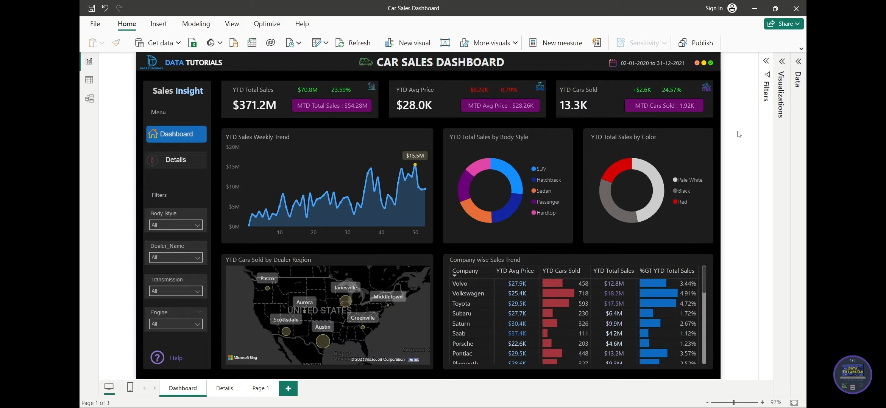

# 🚗 Car Sales Dashboard – Power BI Project

---

## 📌 Project Overview

**Project Title:** Car Sales Dashboard
**Tool Used:** Microsoft Power BI

### 🎯 Objective

The objective of this project is to analyze car sales data and provide **interactive, visual insights** into sales performance, pricing trends, and regional distribution. The dashboard helps stakeholders make **data-driven decisions** by monitoring key sales metrics.

### ❓ Problem Statement

Sales teams faced challenges in tracking **overall sales performance, average pricing, and regional demand trends** from raw data. Lack of a centralized and interactive reporting system made it difficult to identify top-performing products, regions, and companies.

---

## 📊 Data Description

* **Data Source:** Sample car sales dataset (CSV / Excel-based dataset)
* **Data Volume:** ~10,000+ sales records
* **Time Period Covered:** January 2020 – December 2021

### 🔑 Key Data Fields

* Sales Amount
* Car Price
* Cars Sold
* Company / Brand
* Body Style
* Color
* Dealer Region
* Transmission Type
* Engine Type

### 🧹 Data Cleaning & Preparation

* Removed duplicate records
* Handled missing values
* Standardized column names
* Created calculated columns and measures using **DAX**
* Data modeling to establish relationships between tables

---

## 👥 Target Audience

* **Sales Managers:** To monitor sales performance and trends
* **Business Analysts:** To identify growth opportunities
* **Senior Management:** To track KPIs and support strategic planning

---

## ⭐ Key Features of the Dashboard

* **Key KPIs**

  * YTD Total Sales
  * YTD Average Price
  * YTD Cars Sold
  * Month-to-Date (MTD) comparisons

* **Interactive Visualizations**

  * Sales trend analysis over time
  * Sales distribution by body style and color
  * Company-wise performance comparison

* **Geographical Analysis**

  * Dealer-wise and region-wise sales visualization using maps

* **Filters & Slicers**

  * Body Style
  * Dealer Name
  * Transmission
  * Engine Type

* **Drill-down & Interactivity**

  * Enables deeper insights into sales data

---

## 🛠 Tools & Techniques Used

* **Power BI**

  * Data modeling
  * DAX measures (YTD, MTD, % Growth)
  * Interactive dashboards

* **Excel**

  * Initial data preprocessing and validation

* **DAX Functions**

  * CALCULATE
  * TOTALYTD
  * SUM
  * AVERAGE

---

## 📌 Project Scope & Limitations

### ✅ Scope

* Analysis of car sales performance across regions, companies, and product categories
* Time-based sales trend analysis (YTD & MTD)

### ⚠ Limitations

* Dataset is static and does not support real-time updates
* Limited customer demographic data
* No external market or competitor data included

---

## 📈 Outcome / Key Insights

* Identified **top-performing car brands and regions**
* Highlighted sales growth trends over time
* Improved visibility into pricing patterns and demand
* Enabled faster decision-making through interactive KPIs

---

## 🔮 Future Enhancements

* Integration with **real-time sales data sources**
* Addition of **sales forecasting using predictive analytics**
* Customer segmentation analysis
* Deployment via Power BI Service with scheduled refresh

---

## 📂 Repository Contents

* `Car_Sales_Dashboard.pbix` – Power BI dashboard file
* `Dataset/` – Raw data files
* `Dashboad.jpg` – Dashboard preview image
* `README.md` – Project documentation

---

## 🙋‍♂️ Author

**Sahil Ansari**
📧 Email: [your-email@example.com](mailto:your-email@example.com)
🔗 LinkedIn: your-linkedin-url
💻 GitHub: your-github-url

---

### ⭐ If you like this project, feel free to give it a star!

---
