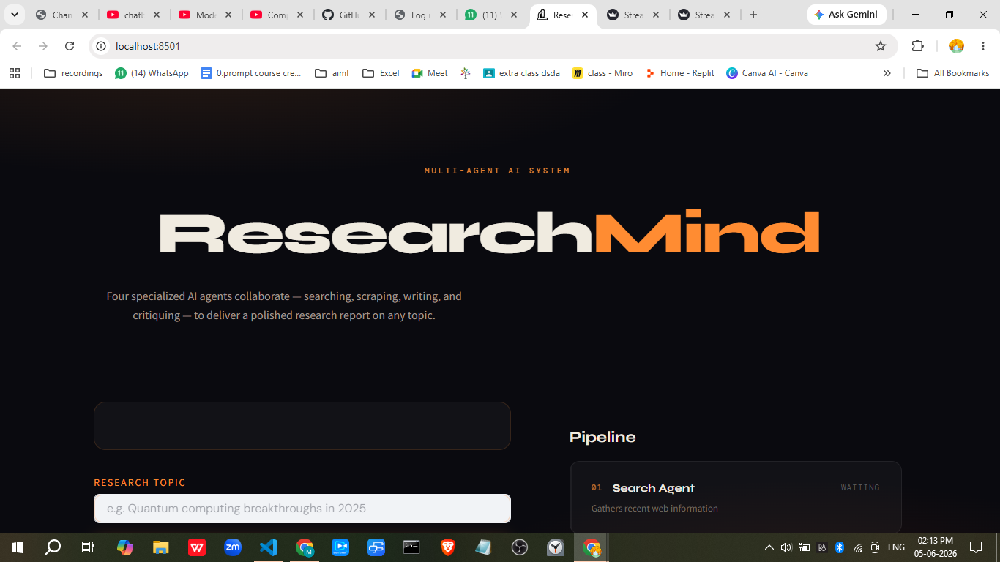
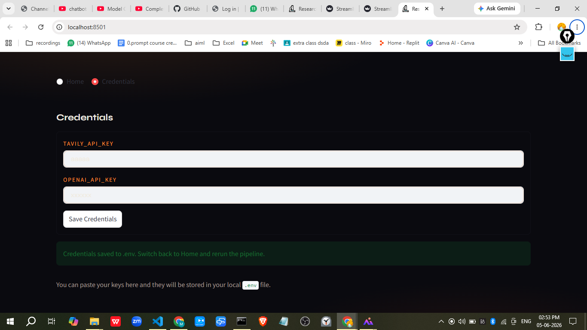
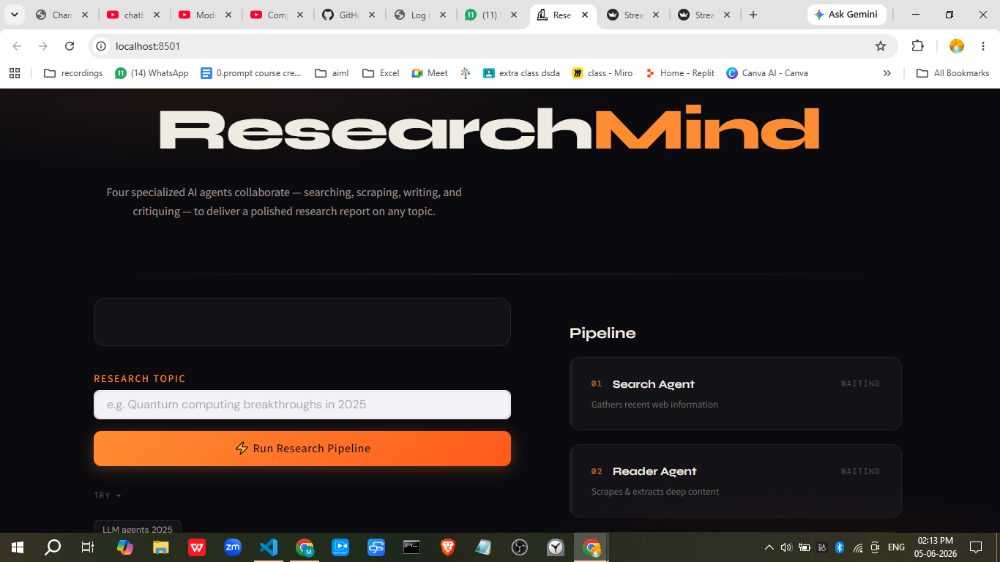
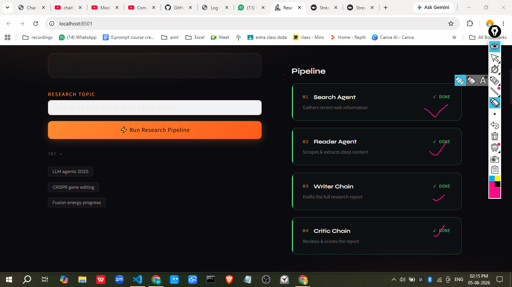
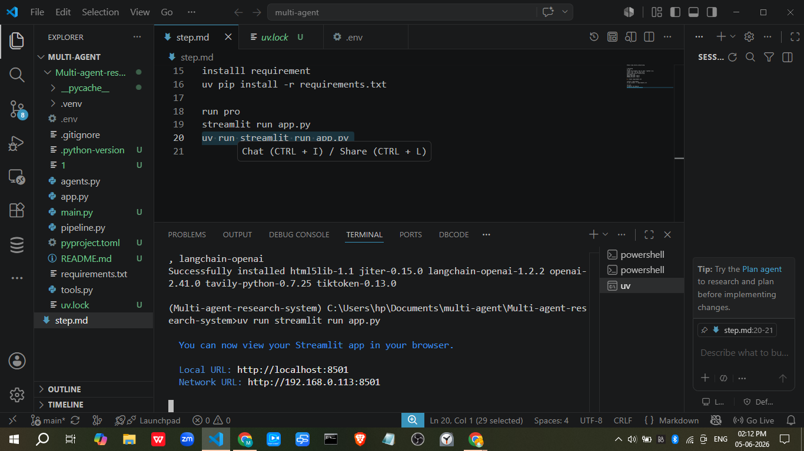
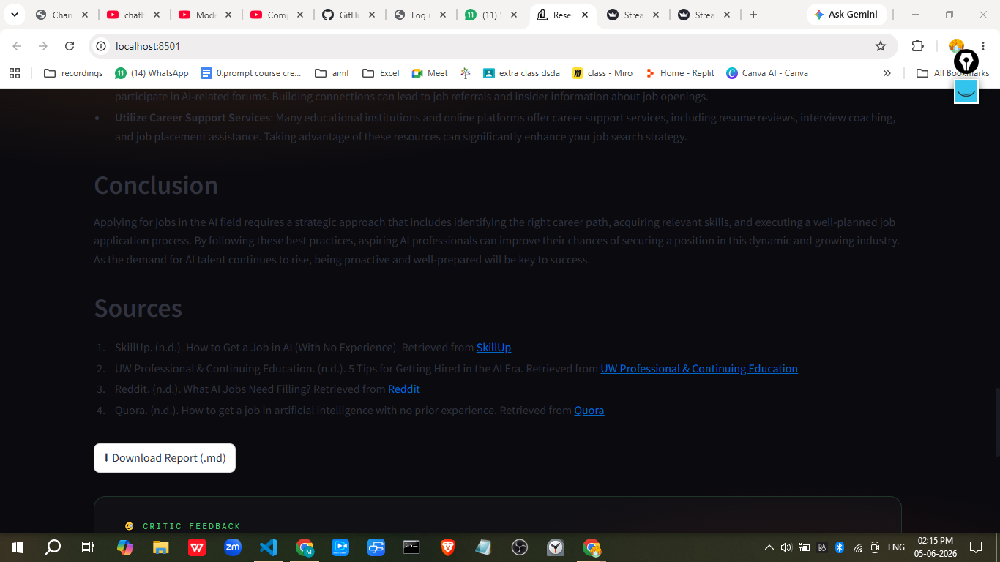
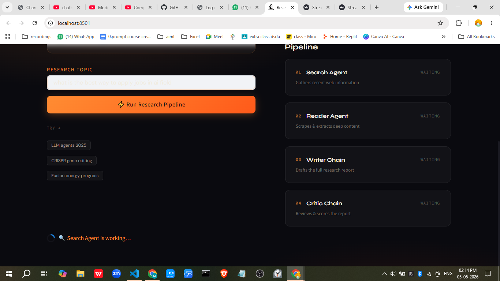

# ResearchMind · Multi-Agent AI Research System

> **Intelligent research automation powered by LangChain, OpenAI, and Tavily Search**

An advanced multi-agent research system that autonomously gathers, analyzes, and synthesizes information into comprehensive research reports. Four specialized AI agents collaborate seamlessly to deliver polished, fact-based insights on any topic.

---

## 🎯 Overview

ResearchMind automates the entire research pipeline:

1. **🔍 Search Agent** – Gathers recent, reliable information from the web
2. **📄 Reader Agent** – Scrapes and extracts deep content from top sources
3. **✍️ Writer Agent** – Drafts comprehensive, structured research reports
4. **🧐 Critic Agent** – Reviews and scores reports for quality assurance

The system leverages **LangChain** for agent orchestration, **OpenAI GPT-4** for reasoning, and **Tavily API** for web search.

---

## ✨ Key Features

- **Multi-Agent Pipeline**: Specialized agents working in parallel for efficiency
- **Real-Time Progress**: Visual pipeline tracking as agents execute
- **Secure Credential Management**: Store API keys in-app via credentials page
- **Markdown Export**: Download research reports as formatted `.md` files
- **Beautiful UI**: Modern, dark-themed interface with responsive design
- **Error Handling**: Graceful fallbacks for missing credentials or API failures

---

## 🚀 Quick Start

### Prerequisites

- **Python 3.12+**
- **API Keys**:
  - [Tavily API Key](https://www.tavily.com/pricing)
  - [OpenAI API Key](https://platform.openai.com/api-keys)

### Installation

```bash
# 1. Clone the repository
git clone <your-repo-url>
cd Multi-agent-research-system

# 2. Create virtual environment
uv venv --python 3.12

# 3. Activate environment
# Windows: .venv\Scripts\activate
# Mac/Linux: source .venv/bin/activate

# 4. Install dependencies
uv pip install -r requirements.txt

# 5. Create .env file with your API keys
echo TAVILY_API_KEY="your_key_here" > .env
echo OPENAI_API_KEY="your_key_here" >> .env

# 6. Run the app
uv run streamlit run app.py
```

The app opens at **http://localhost:8501**

---

## 📖 Usage Guide

### Home Page


Enter your research topic and browse example queries. Click **"Add credentials"** if you haven't already.

### Adding Credentials


Paste your Tavily and OpenAI API keys on the Credentials page. They'll be securely stored in `.env`.

### Search Box


Type your research topic (e.g., "Quantum computing breakthroughs in 2025") and hit "Run Research Pipeline".

### Pipeline Execution


Watch real-time progress as each agent completes:
- Search Agent gathers web results
- Reader Agent scrapes detailed content
- Writer Agent drafts the report
- Critic Agent reviews and scores

### Page 1 Run


Visual feedback shows which steps are waiting, running, or complete.

### Results Display


Raw outputs from each agent (expandable), structured research findings.

### Final Research Report


Polished, markdown-formatted report with:
- Introduction
- Key Findings (3+ points)
- Conclusion
- Sources

---

## 🏗️ Architecture

### Components

| File | Purpose |
|------|---------|
| `app.py` | Streamlit UI, page routing, credentials management |
| `agents.py` | Agent definitions and chain orchestration |
| `tools.py` | Web search and URL scraping tools |
| `requirements.txt` | Python dependencies |
| `.env` | API credentials (gitignored) |

### Workflow

```
User Input (Topic)
    ↓
Search Agent (Tavily Web Search)
    ↓
Reader Agent (URL Scraping)
    ↓
Writer Chain (GPT-4 Report Generation)
    ↓
Critic Chain (Quality Scoring & Feedback)
    ↓
Final Report + Download Option
```

---

## 🛠️ Technology Stack

- **Framework**: Streamlit (Frontend)
- **LLM Orchestration**: LangChain
- **Language Model**: OpenAI GPT-4o-mini
- **Web Search**: Tavily API
- **Web Scraping**: BeautifulSoup4, Requests
- **Environment**: Python 3.12, `uv` package manager

---

## 📋 Requirements

See `requirements.txt` for full list:

```
langchain>=0.2.0
langchain-openai>=0.1.0
openai>=1.30.0
tavily-python>=0.3.0
streamlit>=1.0.0
beautifulsoup4>=4.12.0
requests>=2.31.0
python-dotenv>=1.0.0
```

---

## 🔒 Security

- **API Keys**: Stored locally in `.env` (never committed to git)
- **Credentials Page**: Add/update keys securely in-app
- **No Data Collection**: All processing is local
- **.gitignore**: Protects `.env` and sensitive files

---

## 🚨 Troubleshooting

| Issue | Solution |
|-------|----------|
| "TAVILY_API_KEY not set" | Go to Credentials page and add your key |
| "OpenAI API error" | Verify `OPENAI_API_KEY` is valid and has funds |
| Port 8501 already in use | Run `streamlit run app.py --server.port 8502` |
| Module not found | Re-run `uv pip install -r requirements.txt` |
| Slow web search | Tavily API has rate limits; wait or check quota |

---

## 📝 Example Queries

- "Latest breakthroughs in quantum computing"
- "CRISPR gene editing applications in 2025"
- "Fusion energy progress and challenges"
- "AI safety research developments"
- "Cryptocurrency market trends"

---

## 🤝 Contributing

1. Fork the repository
2. Create a feature branch (`git checkout -b feature/amazing-feature`)
3. Commit changes (`git commit -m 'Add amazing feature'`)
4. Push to branch (`git push origin feature/amazing-feature`)
5. Open a Pull Request

---

## 📄 License

This project is licensed under the MIT License – see LICENSE file for details.

---

## 📞 Support

For issues, questions, or suggestions:
- Open a GitHub Issue
- Check existing documentation in `step.md`
- Verify API credentials and rate limits

---

## 🎓 Learn More

- [LangChain Documentation](https://python.langchain.com/)
- [OpenAI API Reference](https://platform.openai.com/docs/)
- [Tavily Search API](https://tavily.com/docs)
- [Streamlit Documentation](https://docs.streamlit.io/)

---

**Built with ❤️ using LangChain & AI Agents**
