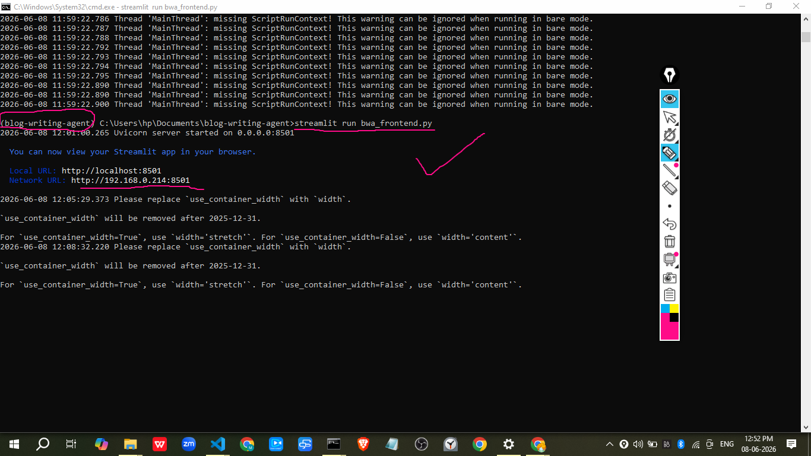
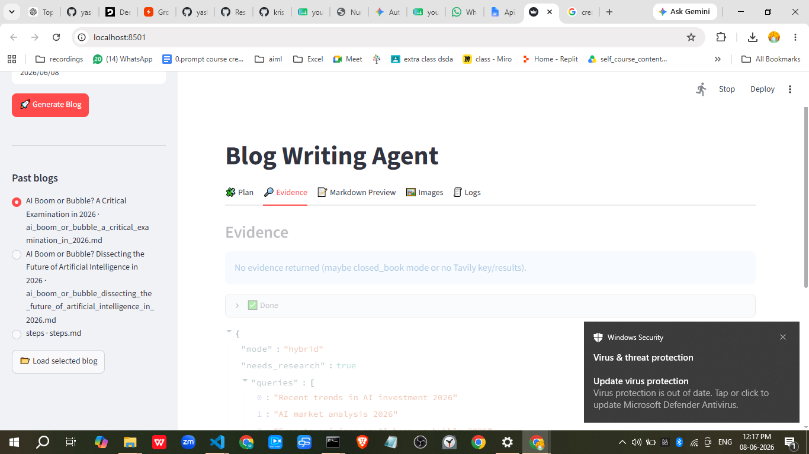
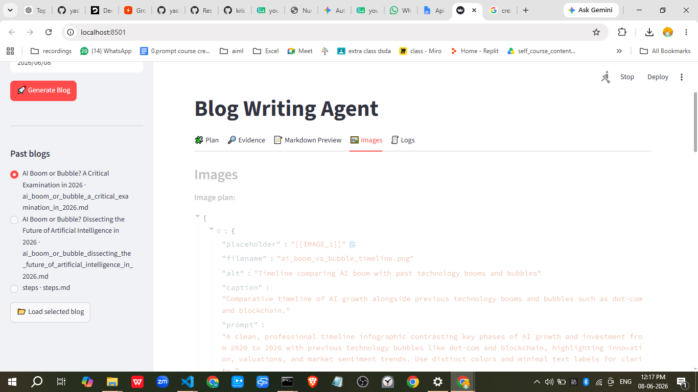

# Blog Writing Agent

This repository contains a small blog-writing agent built with Streamlit, Langchain, and OpenAI/Gemini integrations.

## Overview

Use `steps.md` for the full setup instructions. This `README.md` gives a quick start to install dependencies, configure the environment, and run the frontend app.

## Prerequisites

- Python 3.11.15
- `pip`
- A virtual environment tool (`venv` or equivalent)
- API keys for the services used by the application

## Setup

1. Clone the repository:

   ```bash
   git clone <repo-url>
   cd blog-writing-agent
   ```

2. Create a `.env` file in the project root and add your API keys.

   Example `.env`:
   ```env
   OPENAI_API_KEY=your-openai-api-key
   TAVILY_API_KEY=your-tavily-api-key
   GOOGLE_API_KEY=your-google-api-key
   ```

3. Create and activate a virtual environment:

   ```bash
   python -m venv .venv
   .venv\Scripts\Activate.ps1
   ```

4. Install dependencies:

   ```bash
   pip install -r requirements.txt
   ```

## Run the App

Start the Streamlit frontend:

```bash
streamlit run bwa_frontend.py
```

Then open the local Streamlit URL in your browser.

## Usage

- Use the frontend to enter a topic.
- Click the generate button to create blog output.
- The app may optionally use research support and image generation.

## Images
The app references image assets in the `img/` folder. Example images included in this repo:

- **Home page:** 
- **Run example:** 
- **Page 3:** 
- **Page 4:** 
- **Page 5:** 
- **Page 6:** 

If you prefer a different folder, update the app code or README references accordingly.

## Notes

- `steps.md` contains the original setup instructions and should be consulted for detailed steps.
- The current project structure includes `bwa_frontend.py`, `bwa_backend.py`, and notebooks for experimentation.
- Use `pip freeze > requirements.txt` to regenerate dependency listings after installing new packages.
